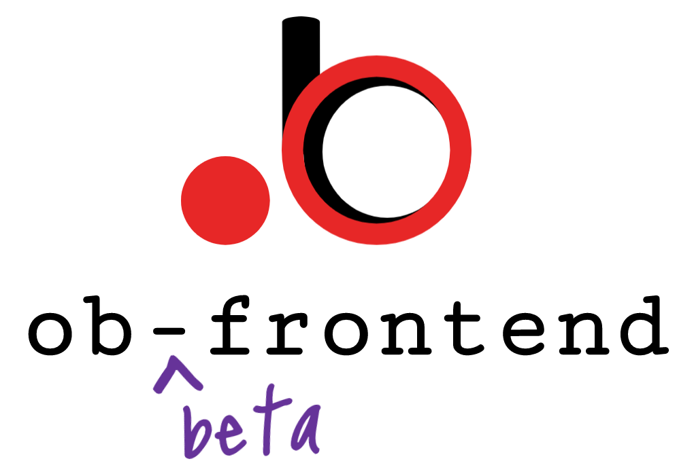
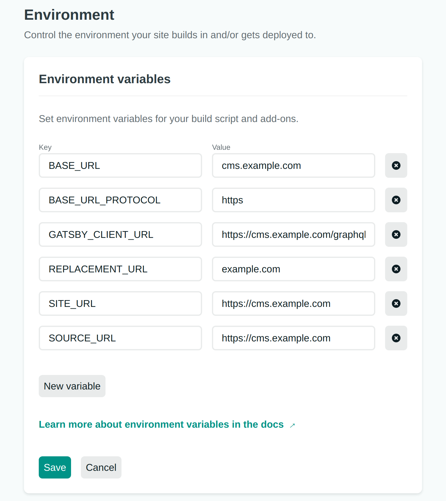

<h1 align="center">
    
</h1>

<h4 align="center">
    <strong>ob-frontend</strong> is a <a href="https://www.gatsbyjs.com/docs/glossary/headless-wordpress/">headless</a> WordPress starter theme built with <a href="https://www.gatsbyjs.com/docs/">Gatsby</a>.
</h4>

## Table of contents
+ [Overview](#overview)
+ [Demo](#demo)
+ [Screenshots](#screenshots)
+ [Features](#features)
+ [Core Dependencies](#core-dependencies)
+ [Quick Start](#quick-start)
+ [Deploy with Netlify](#deploy-with-netlify)
+ [Folder Structure](#folder-structure)
+ [Credits](#credits)
+ [Contributors](#contributors)
+ [License](#license)

## Overview
**ob-frontend** is a modern implementation of the WordPress frontend as a [single-page application (SPA)](https://docs.microsoft.com/en-us/dotnet/architecture/modern-web-apps-azure/choose-between-traditional-web-and-single-page-apps#when-to-choose-spas).  This template, developed and packaged as a [Gatsby starter](https://www.gatsbyjs.com/docs/starters/), is a [solution](https://searchitchannel.techtarget.com/definition/solution) for developers looking for the ease-of-use and flexibility that comes with using WordPress as a [CMS](https://www.hostinger.com/tutorials/what-is-wordpress), paired with the familiar development experience and modern UI features of a [React](https://reactjs.org/)/[GraphQL](https://graphql.org/) implementation.  The **ob-frontend** Gatsby Starter attempts to closely mirror many of the core features and functionality of the familiar WordPress UI, such as nested comments, post sidebar layout, and a mailing list widget.

## Demo
View a live demo of this application [here](https://ob-frontend.netlify.app/).

## Screenshots
<h1 align="left">
    
</h1>

<h1 align="left">
    
</h1>

<h1 align="left">
    
</h1>

<h1 align="left">
    
</h1>


## Features
+ Post, page, and comment list functionality supported by [Apollo client](https://www.apollographql.com/docs/react/).
+ Modern UI powered by [Bloomer](https://bloomer.js.org) React components for Bulma.
+ Feature-rich design capabilities supported by [Sass](https://sass-lang.com).
+ Dynamic support for changing theme colors.
+ Support for featured posts on homepage.
+ Mailing list integration with [Mailchimp](https://mailchimp.com).
+ Functionality for searching posts.
+ Support for threaded (nested) comments 2 levels deep.
+ Functionality for posting top-level (parent) comments.
+ Functionality for adding replies to nested (child) comments.
+ Mobile-first responsive design.
+ Pagination support.
+ [React-icons](https://react-icons.github.io/).

## Core Dependencies
+ [WordPress](https://en.wikipedia.org/wiki/WordPress) backend (tested with 5.5)
+ [WPGraphQL](https://www.wpgraphql.com/) (tested with 0.11).
+ [Node.js](https://nodejs.org/en/about/) (tested with 14.02).
+ [Gatsby CLI](https://www.gatsbyjs.com/docs/gatsby-cli/) (tested with 2.12.21)
+ [GraphQL](https://graphql.org/) (tested with 15.0)
+ [Apollo Client](https://www.apollographql.com/docs/react/) (tested with 2.6.10) 

## Quick Start
#### 1.  Deploy a WordPress backend
This starter theme relies on a WordPress backend from which to fetch data related to WordPress posts, pages, comments, etc.  You can deploy the WordPress backend using the hosting provider of your choice. In the above demo, the WordPress backend is deployed on a GCP Compute Engine f1-micro VM Instance.  

#### 2.  Configure a domain name
Configure a domain name for your WordPress backend (with HTTPS).  In this example, the WordPress backend is served from a subdomain (cms.example.com), and the WordPress frontend (ie. ob-frontend) is served from the root domain (example.com).  Serving the WordPress backend from a subdomain is optional, however, you will need to change the **SOURCE_URL** environment variable to match the URL of your WordPress backend.

#### 3.  Create a Gatsby site
Use the Gatsby CLI to create a new site, specifying the ob-frontend starter.

```sh
# Create a new Gatsby site using the ob-frontend starter
gatsby new blog https://github.com/onepagezen/ob-frontend
```

#### 4.  Create environment variable files
This theme relies heavily on enivronment variables in order to get up and running quickly.  After creating the site using the Gatsby CLI (step 3), run the following commands to configure the environment variables for your site:
```sh
# Navigate into your new site's directory  
cd ob-frontend  
  
# Create .env files for both the development and production environments
touch .env.development .env.production
```

#### 5.  Add development environment variables
Add the following environment variables to your **.env.development** file, making sure to replace **example.com** with your own domain name, and **MAILCHIMP_ENDPOINT** with the [form action URL](https://secomapp.zendesk.com/hc/en-us/articles/360031503791-How-to-find-the-MailChimp-Form-Action-URL-) of your MailChimp mailing list:
```sh
SITE_URL=https://localhost:8000
BASE_URL=cms.example.com
BASE_URL_PROTOCOL=https
SOURCE_URL=https://cms.example.com
REPLACEMENT_URL=localhost:8000
GATSBY_CLIENT_URL=https://cms.example.com/graphql
MAILCHIMP_ENDPOINT=https://example.us17.list-manage.com/subscribe/post?u=0893ac8473c98fa98eeef3fd5&amp;id=f4cbbd81d6
```

#### 6.  Add production environment variables
Add the following environment variables to your **.env.production** file, making sure to replace **example.com** with your own domain name, and **MAILCHIMP_ENDPOINT** with the endpoint of your Mailchimp mailing list:
```sh
SITE_URL=https://example.com
BASE_URL=cms.example.com
BASE_URL_PROTOCOL=https
SOURCE_URL=https://cms.example.com
REPLACEMENT_URL=example.com
GATSBY_CLIENT_URL=https://cms.example.com/graphql
MAILCHIMP_ENDPOINT=https://example.us17.list-manage.com/subscribe/post?u=0893ac8473c98fa98eeef3fd5&amp;id=f4cbbd81d6
```

## Deploy with Netlify
#### 1.  Deploy the site
Use the **Deploy with Netlify** button to quickly deploy a website based on this starter.  
<a href="https://app.netlify.com/start/deploy?repository=https://github.com/onepagezen/ob-frontend" target="_blank"></a>  

#### 2.  Configure environment variables
When deploying with Netlify, make sure to add the production environment variables to your Netlify build environment.  One option is to add them in your site dashboard under **Settings > Build & deploy > Environment > Environment variables**.  



## Directory Structure

```sh
📂 src
├──📂 apollo # Apollo Client integration
├──📂 comments # comment functionality for posts
├──📂 components # layout and SEO components
├──📂 images # local site images
├──📂 mailchimp # mailing list integration
├──📂 pages # all site pages
├──📂 search # search and retrieve posts by query
├──📂 styles # SCSS for styling
└──📂 templates # dynamically generate posts and pages
```

## Credits
+ [Gatsby Starter Bloomer](https://github.com/zlutfi/gatsby-starter-bloomer) by [Zlutfi](https://github.com/zlutfi)
+ [Forward and Backward Pagination with WPGraphQL](https://www.wpgraphql.com/2020/03/26/forward-and-backward-pagination-with-wpgraphql/) by [Jason Bahl](https://github.com/jasonbahl)  
+ [Dynamic Comments with Gatsby and WordPress](https://northstack.com/dynamic-comments-gatsby-wordpress/) by [Jeff Matson](https://github.com/JeffMatson)  
+ [Overview - Guide to Gatsby WordPress Starter Advanced with Previews, i18n and more](https://dev.to/nevernull/basic-wordpress-gatsby-setup-guide-to-gatsby-wordpress-starter-advanced-with-previews-i18n-and-more-44d8) by [Henrick Wirth](https://github.com/henrikwirth)  
+ [Creating a Gatsby Front-End with a WordPress CMS](https://raquelmsmith.com/blog/creating-a-gatsby-front-end-with-a-wordpress-cms/) by [Raquel Smith](https://github.com/raquelmsmith)
+ [Build an App Using React and the GraphQL Plugin for WordPress in ~15mins](https://www.wpgraphql.com/2019/01/10/build-an-app-using-react-and-the-graphql-plugin-for-wordpress-in-15mins/) by [Kellen Mace](https://github.com/kellenmace)  
+ [How To Build A Blog with WordPress and Gatsby.js](https://www.gatsbyjs.com/blog/2019-04-26-how-to-build-a-blog-with-wordpress-and-gatsby-part-1/) by [Tim Smith](https://github.com/iamtimsmith)


## Contributors
[](https://github.com/petejos80) |[](https://github.com/leronamin) |
:---: |:---: |
[petejos80](https://github.com/petejos80) |[leronamin](https://github.com/leronamin) |

## License
The MIT License (MIT)

Copyright (c) 2016-2020 One Page Zen Systems, LLC

Permission is hereby granted, free of charge, to any person obtaining a copy of this software and associated documentation files (the "Software"), to deal in the Software without restriction, including without limitation the rights to use, copy, modify, merge, publish, distribute, sublicense, and/or sell copies of the Software, and to permit persons to whom the Software is furnished to do so, subject to the following conditions:

The above copyright notice and this permission notice shall be included in all copies or substantial portions of the Software.

THE SOFTWARE IS PROVIDED "AS IS", WITHOUT WARRANTY OF ANY KIND, EXPRESS OR IMPLIED, INCLUDING BUT NOT LIMITED TO THE WARRANTIES OF MERCHANTABILITY, FITNESS FOR A PARTICULAR PURPOSE AND NONINFRINGEMENT. IN NO EVENT SHALL THE AUTHORS OR COPYRIGHT HOLDERS BE LIABLE FOR ANY CLAIM, DAMAGES OR OTHER LIABILITY, WHETHER IN AN ACTION OF CONTRACT, TORT OR OTHERWISE, ARISING FROM, OUT OF OR IN CONNECTION WITH THE SOFTWARE OR THE USE OR OTHER DEALINGS IN THE SOFTWARE.
